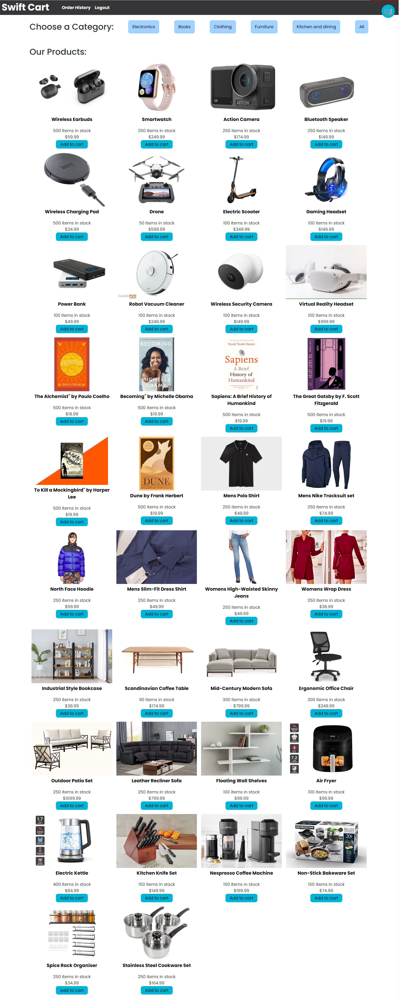
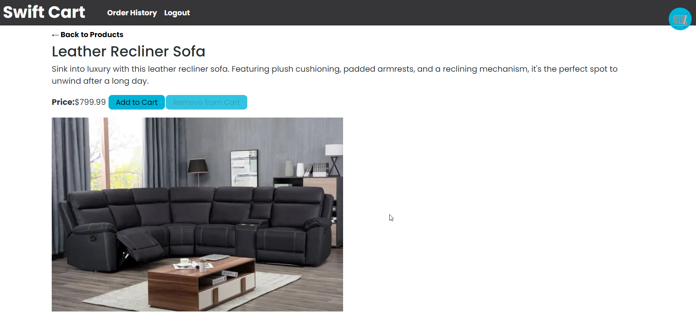
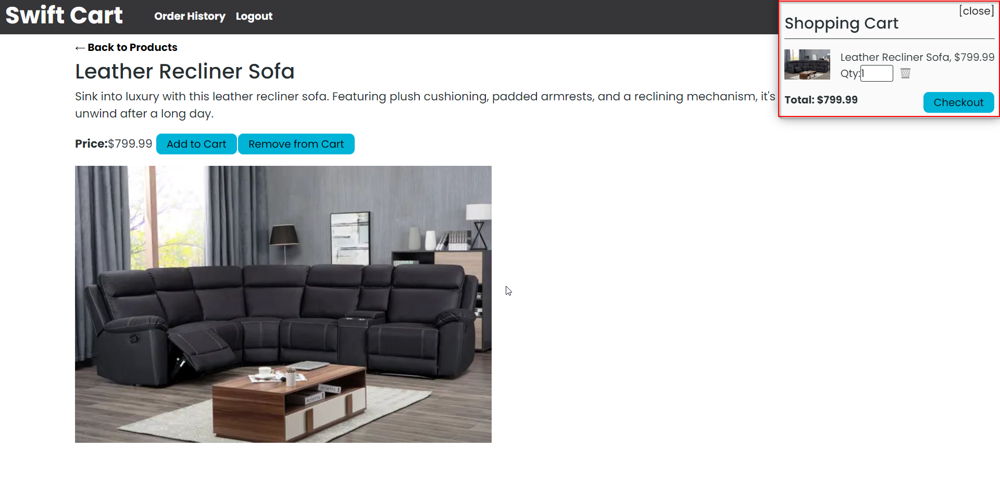
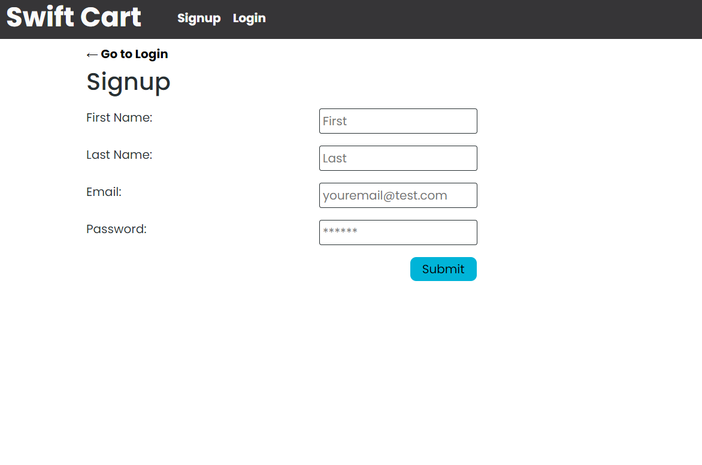
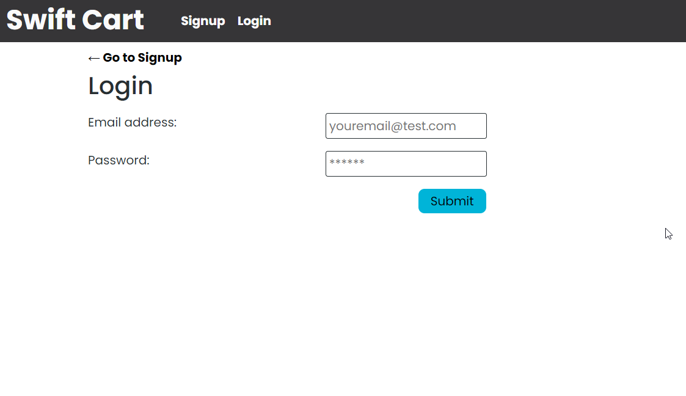
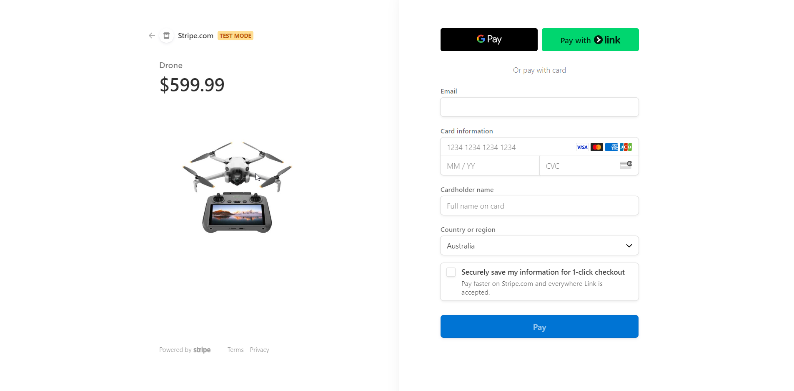
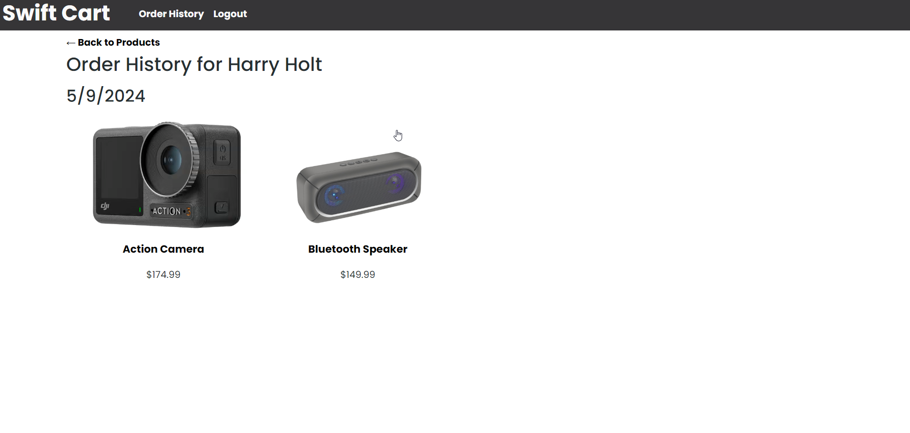

# Swift Cart: The Ultimate destination for online shoppers


## Description

SwiftCart is the ultimate destination for online shoppers, offering a seamless experience from browsing to checkout. With a wide range of products neatly categorized for easy navigation, SwiftCart makes finding the perfect item effortless.


          


## Table of Contents

- [Technologies Used](#technologies-used)
- [Installation](#installation)
- [User Story](#user-story)
- [Acceptance Criteria](#acceptance-criteria)
- [Usage](#usage)
- [Contributing](#contributing)
- [License](#license)
- [Questions](#questions)


## Technologies Used

- Javascript
- Express.js (4.18.2)
- Node.js
- React
- MongoDB
- Express Session (3.1.0)
- React Router
- Bcrypt (5.1.1)
- Vite
- Apollo GraphQL
- Nodemon
- Redux
- Stripe
- JWT (JSON Web Tokens)
- Render (For deployment)


## Installation

To install this application please do the following:

1. Clone the repository to your local machine.

    git@github.com:Y1va/Ecommerce-MERN.git

2. Open the project folder in your preferred code editor.

3. Install the necessary dependencies by running the command in the root directory. This is because there is a script in the package.json that will automatically install the dependencies for the server and client folders:

    `npm install`

4. Once the necessary dependencies have been installed you can fire up the app locally by issuing the following command:

    `npm run develop`


## User Story

```
AS A user, I WANT to be able to browse products conveniently by categories, SO THAT I can easily find what I'm looking for.
AS A user, I WANT to add products to my shopping cart and see a summary of my cart, SO THAT I can keep track of my purchases.
AS A user, I WANT to be able to securely log in and out of my account, SO THAT I can access my saved information and track my orders.
AS A user, I WANT to be able to securely checkout and pay for my purchases using Stripe, SO THAT I can complete my transactions with peace of mind.
```

## Acceptance Criteria
```
GIVEN an Ecommerce website called Swift Cart
WHEN I visit the site for the first time
THEN I am presented with a neatly layed out homepage showing a variety of ecommerce products
WHEN I press the sign up button as a new user
THEN I am presented with a registration page to enter firstname, lastname, email and password
WHEN I press the login button
THEN I can login with my newly created credentials
WHEN I choose a category from Electronics, Books, Clothing, Furniture, Kitchen and Dining and All
THEN I am able to see all products related to that category
WHEN I click on a product
THEN I can see an enlarged image with a detailed description about the product alongside the price and an add to cart button
WHEN I click the add to cart button on a product
THEN I can see a pop up window of my cart in the top right side of the screen showing what is currently in the cart and the price as well as a checkout button
WHEN I am satisfied with my order and click the checkout button
THEN I am taken to a Stripe payment window and can see my order with pictures on the left hand side of the screen
WHEN I put in my TEST credit card details
THEN I am redirected back to the website with a message that displays a success message.
WHEN I click on Order History in the Navbar
THEN I am presented with text that says order history for the users name as well as the date it was purchsaed and images of the products. 
```

## Usage

Below are some screenshots showing all parts of the application.

Landing page of Swift Cart:



Product Review:




Shopping cart:




Registration/Signup page:




Login Page:




Stripe Payment Page:




Order History:




## Contributing

- Adrian Ponze: [GitHub](https://github.com/Y1va)
- Amir Tara: [Github](https://github.com/Bjorn-Ironsidee)


## License

This project is license under the MIT license